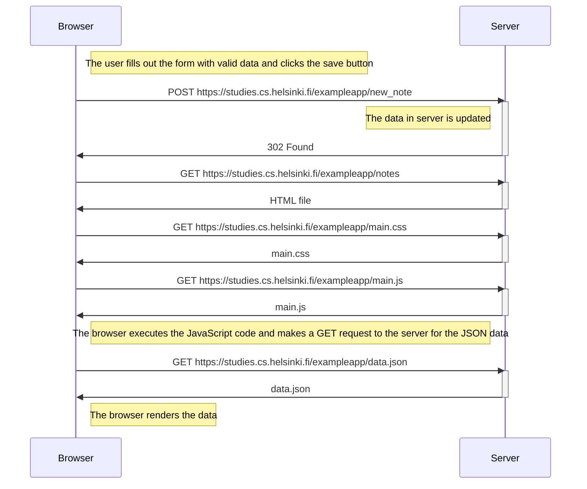
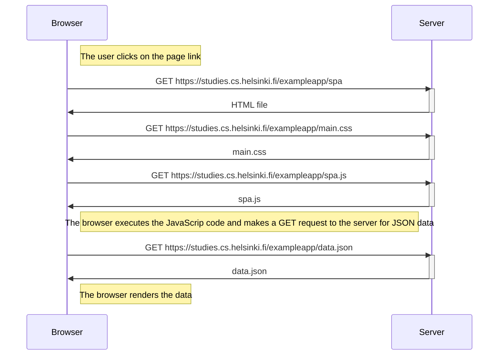
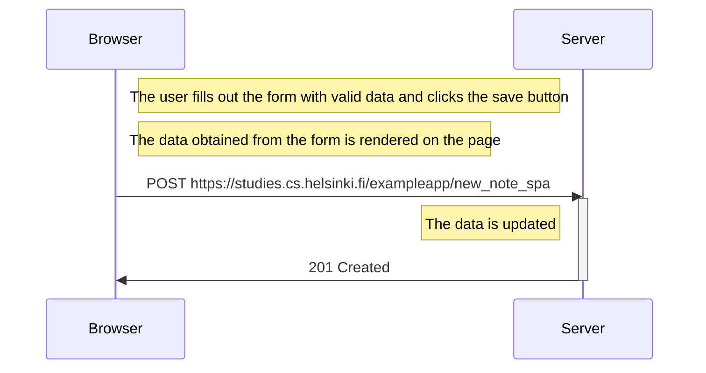

# Full Stack Open Course Part 0 Exercises

## 0.4 New note diagram

```mermaid
sequenceDiagram
    participant Browser
    participant Server

    Note right of Browser: The user fills out the form with valid data and clicks the save button

    Browser ->> Server: POST https://studies.cs.helsinki.fi/exampleapp/new_note
    activate Server
    Note left of Server: The data in server is updated
    Server ->> Browser: 302 Found
    deactivate Server

    Browser ->> Server: GET https://studies.cs.helsinki.fi/exampleapp/notes
    activate Server
    Server ->> Browser: HTML file
    deactivate Server

    Browser ->> Server: GET https://studies.cs.helsinki.fi/exampleapp/main.css
    activate Server
    Server ->> Browser: main.css
    deactivate Server

    Browser ->> Server: GET https://studies.cs.helsinki.fi/exampleapp/main.js
    activate Server
    Server ->> Browser: main.js
    deactivate Server

    Note right of Browser: The browser executes the JavaScript code and makes a GET request to the server for the JSON data

    Browser ->> Server: GET https://studies.cs.helsinki.fi/exampleapp/data.json
    activate Server
    Server ->> Browser: data.json
    deactivate Server

    Note right of Browser: The browser renders the data
```

## 0.5 Single page application diagram

```mermaid
sequenceDiagram
    participant Browser
    participant Server

    Note right of Browser: The user clicks on the page link

    Browser ->> Server: GET https://studies.cs.helsinki.fi/exampleapp/spa
    activate Server 
    Server ->> Browser: HTML file
    deactivate Server

    Browser ->> Server: GET https://studies.cs.helsinki.fi/exampleapp/main.css
    activate Server 
    Server ->> Browser: main.css
    deactivate Server

    Browser ->> Server: GET https://studies.cs.helsinki.fi/exampleapp/spa.js
    activate Server 
    Server ->> Browser: spa.js
    deactivate Server

    Note right of Browser: The browser executes the JavaScrip code and makes a GET request to the server for JSON data

    Browser ->> Server: GET https://studies.cs.helsinki.fi/exampleapp/data.json
    activate Server 
    Server ->> Browser: data.json
    deactivate Server

    Note right of Browser: The browser renders the data
```

## 0.6 New note in single page application

```mermaid
sequenceDiagram
    participant Browser
    participant Server

    Note right of Browser: The user fills out the form with valid data and clicks the save button

    Note right of Browser: The data obtained from the form is rendered on the page
    
    Browser ->> Server: POST https://studies.cs.helsinki.fi/exampleapp/new_note_spa
    activate Server
    Note left of Server: The data is updated
    Server ->> Browser: 201 Created
    deactivate Server
```
